<h1 align="center">
  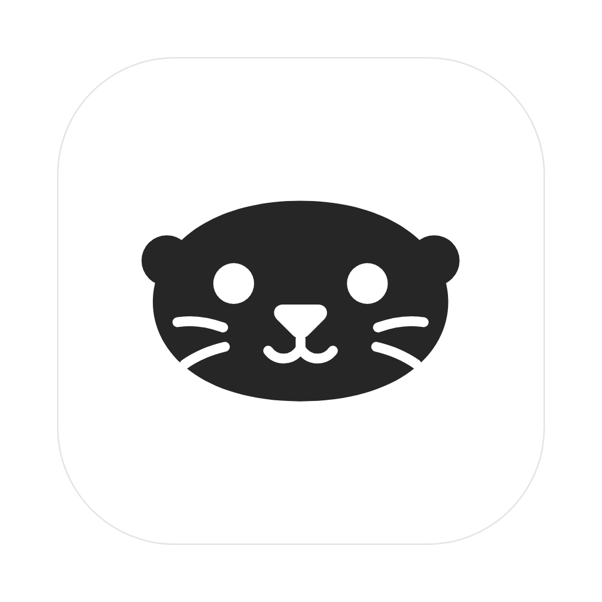<br/>
  Sudal
</h1>

<p align="center"><strong>한국어</strong> · <a href="README.md">English</a></p>

<p align="center">
  <a href="https://github.com/97kim/sudal/releases"></a>
  
  
</p>

<p align="center">
  <strong>에이전트가 다른 에이전트에게 일을 맡기고, 결과를 받아 와요.</strong><br/>
  Claude Code와 Codex를 워크스페이스의 탭으로 띄우는 macOS 앱이에요.
</p>

<p align="center">
  <a href="#설치"><strong>설치</strong></a> · <a href="#첫-작업-시작하기">첫 작업 시작하기</a> · <a href="docs/GUIDE.ko.md">기능 안내</a> · <a href="https://github.com/97kim/sudal/releases">릴리즈</a> · <a href="https://github.com/97kim/sudal/issues">문제 신고</a>
</p>

<p align="center">
  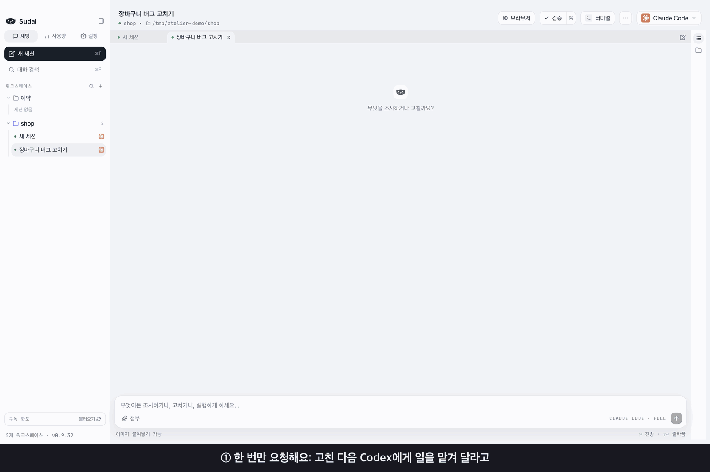
</p>

<p align="center">
  <sub>Claude에게 "고친 다음, 수량이 없을 때 처리와 그 테스트는 Codex에게 맡겨 줘"라고만 했어요. Claude가 직접 Codex 탭을 열어 일을 넘기고, 끝나면 결과를 받아 테스트하고 정리해요. (기다리는 구간은 빠르게 감았어요)</sub>
</p>

Sudal 전용 계정은 필요 없어요. 로그인해 둔 `claude`·`codex` CLI를 앱이 찾아서 쓰니, `CLAUDE.md`·스킬·MCP 서버 같은 설정이 터미널에서 쓸 때와 똑같이 적용돼요.

## 에이전트가 직접 일을 맡겨요

앱 안의 Claude Code·Codex가 `sudal` CLI로 새 탭을 열어 일을 넘기고, 끝나면 결과를 읽어 와요. 탭을 열고 결과를 옮겨 오는 일은 에이전트가 해요.
설정 → 일반 → **CLI와 에이전트 스킬**에서 CLI와 스킬을 설치해 두면 에이전트가 이 사용법을 알게 돼요. 설치한 뒤에 새로 시작한 세션부터 적용돼요. 같은 명령을 터미널에서 직접 써도 돼요.

```
sudal tab new --provider codex --title "리뷰" --prompt "방금 바꾼 코드를 리뷰해 줘"
sudal tab send --tab 리뷰 --text "테스트도 돌려 줘" --wait
sudal tab read --tab 리뷰 --last 3
```

## 기능

<table>
<tr>
<td width="42%" valign="middle">

### 버튼 하나로 교차 리뷰

헤더의 `···` → "교차 리뷰"를 누르면 지금 탭의 변경을 반대쪽 에이전트의 새 탭에 보내요. 리뷰 결과는 원래 탭에 카드로 돌아와요.

</td>
<td width="58%">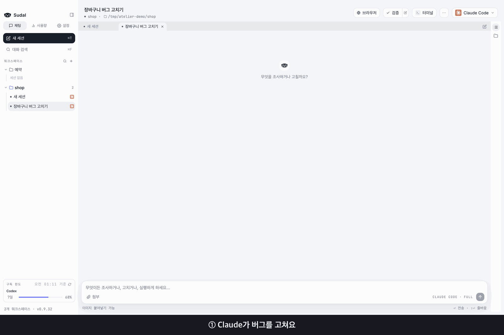</td>
</tr>
<tr>
<td width="42%" valign="middle">

### 큰 작업은 워커들에게 나눠 맡겨요

코디네이터 탭이 작업을 나눠 워커 탭들에 맡겨요. 워커는 막히면 묻고, 끝나면 보고해요. 작업 순서와 사람이 결정할 지점도 정해 둘 수 있어요.

</td>
<td width="58%">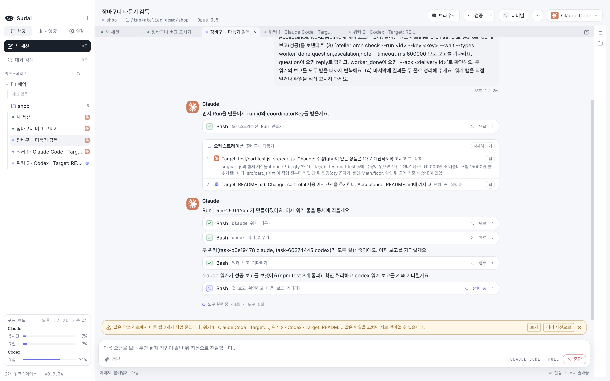</td>
</tr>
<tr>
<td width="42%" valign="middle">

### 같은 요청을 여러 에이전트에 보내고 비교해요

팬아웃은 같은 요청을 격리된 git worktree의 여러 세션에 동시에 보내요. 결과 diff를 나란히 비교하고 마음에 드는 것만 원본에 가져와요.

</td>
<td width="58%">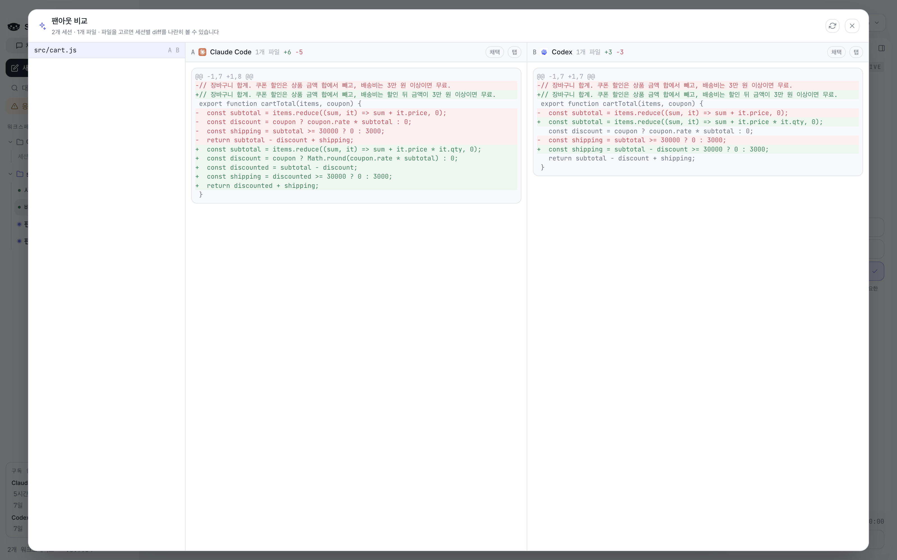</td>
</tr>
<tr>
<td width="42%" valign="middle">

### 무엇을 하려는지 먼저 보여 줘요

파일을 바꾸거나 명령을 실행하기 전에 권한 카드로 물어봐요. 읽은 파일, 실행한 명령, 바꾼 코드는 툴 카드로 쌓여서 터미널 출력을 쫓지 않아도 돼요.

</td>
<td width="58%">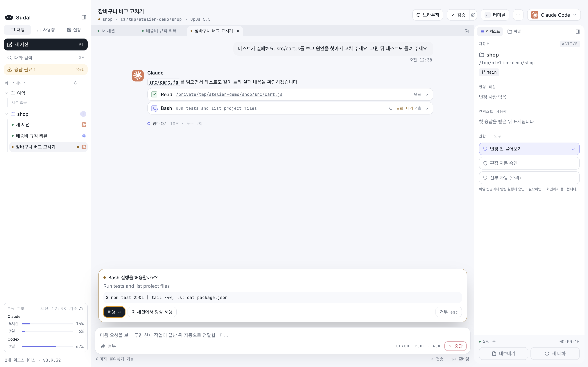</td>
</tr>
<tr>
<td width="42%" valign="middle">

### 바뀐 걸 확인하고 커밋해요

테스트·빌드 명령을 버튼 하나로 돌리면 결과가 대화에 카드로 남아요. 바뀐 파일을 diff로 보고, 커밋 메시지 초안을 받아 앱 안에서 바로 커밋해요.

</td>
<td width="58%">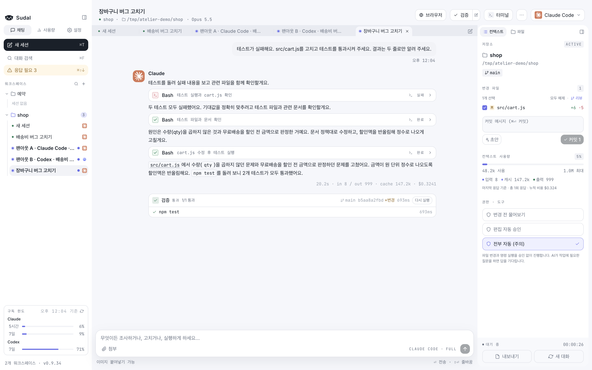</td>
</tr>
<tr>
<td width="42%" valign="middle">

### 파일을 열어 바로 고쳐요

답변 속 파일 이름을 누르면 코드 에디터가 그 줄로 열려요. 에이전트가 바꾼 줄은 diff 색으로 표시돼요. 언어 서버(LSP)를 설치하면 자동완성과 정의로 이동도 써요.

</td>
<td width="58%">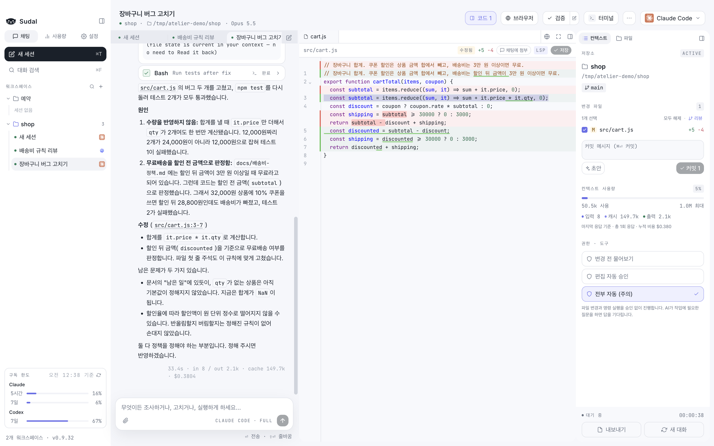</td>
</tr>
<tr>
<td width="42%" valign="middle">

### 마크다운은 문서처럼 읽어요

마크다운 파일은 표·인용·코드·체크리스트까지 정리된 미리보기로 열려요. "편집"을 누르면 바로 고칠 수 있어요.

</td>
<td width="58%">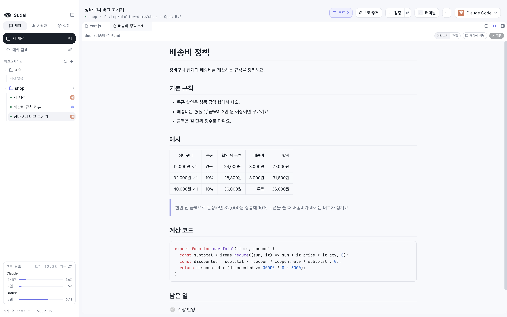</td>
</tr>
<tr>
<td width="42%" valign="middle">

### 터미널이 옆에 있어요

터미널을 채팅 아래나 오른쪽에 열고 좌우·상하로 나눠요. 툴 카드의 명령을 터미널에 바로 넣고, 출력의 주소나 파일 경로를 누르면 브라우저·에디터로 열려요.

</td>
<td width="58%">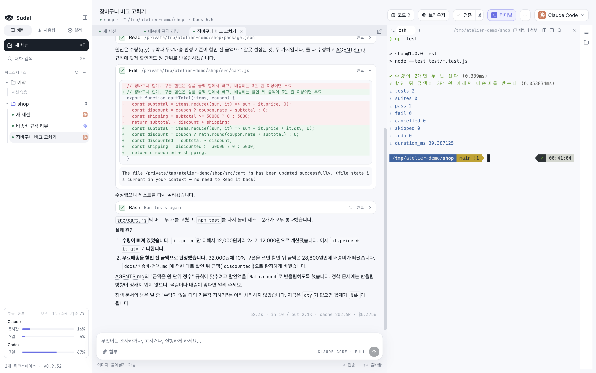</td>
</tr>
<tr>
<td width="42%" valign="middle">

### 터미널에서 이어가기

`···` → "터미널에서 이어가기"를 누르면 같은 대화를 터미널의 Claude·Codex CLI에서 이어 가요. CLI에서 주고받은 내용은 채팅에도 따라 그려지고, CLI를 끝내면 채팅으로 돌아와요.

</td>
<td width="58%">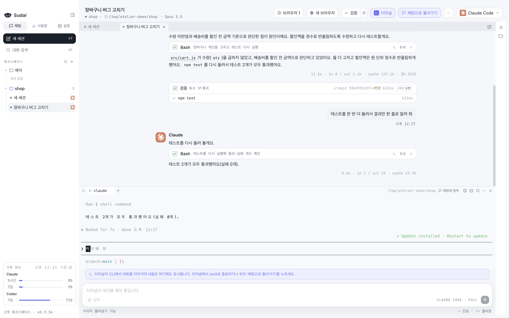</td>
</tr>
<tr>
<td width="42%" valign="middle">

### 고친 화면을 인앱 브라우저로 확인해요

개발 중인 화면을 채팅 옆에 띄우고, 폰·태블릿 폭으로 바꿔 봐요. 에이전트도 `sudal browser`로 그 페이지를 읽고 눌러 보며 고친 화면을 스스로 확인해요.

</td>
<td width="58%">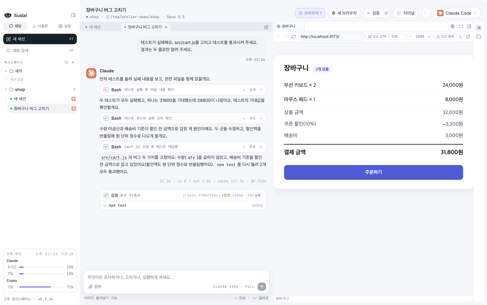</td>
</tr>
<tr>
<td width="42%" valign="middle">

### 수대리가 상태를 알려 줘요

다른 앱에서 일하는 동안 바탕화면 구석의 수달 캐릭터 수대리가 에이전트 상태를 알려 줘요. 일하는 중에는 조개를 두드리고, 승인이나 답을 기다리면 손을 들고, 끝나면 조개를 자랑해요. 수대리를 누르면 그 탭으로 가요. 설정 → 일반 → 수대리 띄우기에서 켜요.

</td>
<td width="58%">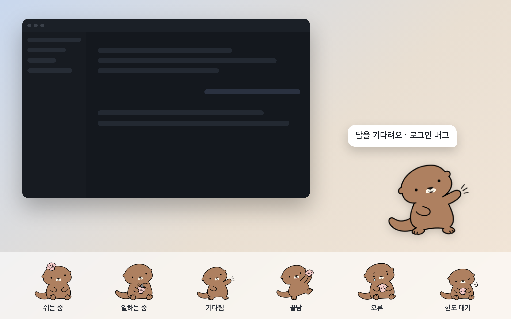</td>
</tr>
</table>

## 지원하는 에이전트

| 에이전트 | 필요한 것 |
|---|---|
| Claude Code | 로그인을 마친 `claude` CLI |
| Codex | 로그인을 마친 `codex` CLI |

둘 중 하나만 있어도 쓸 수 있어요. 대화 도중에 에이전트를 바꾸면 지금까지의 대화를 요약해서 넘겨줘요.

## 설치

**필요한 것**: Apple Silicon Mac(macOS 13 이상), 그리고 로그인을 마친 `claude`와 `codex` CLI 중 하나 이상.
아직 없다면 [Claude Code 설치](https://code.claude.com/docs/en/setup)나 [Codex CLI 설치](https://developers.openai.com/codex/cli) 안내를 따라 설치하고 로그인해 두세요.

Homebrew로 설치해요.

```
brew tap 97kim/sudal
brew trust --cask 97kim/sudal/sudal
brew install --cask sudal
```

- `brew tap`은 Sudal cask가 있는 저장소를 Homebrew에 추가해요.
- `brew trust`는 Homebrew 7부터 필요한 단계예요. 공식 목록 밖의 cask는 신뢰한다고 한 번 알려 줘야 설치할 수 있어요. 위 명령은 이 탭 전체가 아니라 Sudal 하나만 신뢰해요.
- 새 버전이 나오면 사이드바 왼쪽 아래의 버전 옆에 업데이트 버튼이 나타나요. 누르면 진행 상황이 보이고, 끝나면 다시 시작해요. **설정 → 일반 → 업데이트**에서 받거나, 터미널에서 `brew update && brew upgrade --cask sudal`로 받아요. `brew upgrade`만 실행하면 탭이 갱신되지 않아 새 버전을 찾지 못해요.

**처음 열 때**: 서명과 공증(notarization)을 하지 않은 앱이라 macOS가 한 번 막아요. 앱을 열어 보고 차단 안내가 뜨면 **시스템 설정 → 개인정보 보호 및 보안**에서 "그래도 열기"를 누르세요. 한 번 허용하면 이후 업데이트에도 이어져요.

<details>
<summary>"그래도 열기"가 안 보이면</summary>

터미널에서 quarantine 속성을 지우면 바로 열려요.

```
xattr -d com.apple.quarantine /Applications/Sudal.app
```

</details>

Homebrew 없이 설치하려면 [릴리즈](https://github.com/97kim/sudal/releases)에서 DMG를 받아 `Sudal.app`을 Applications 폴더로 옮기세요.

## 첫 작업 시작하기

1. 사이드바의 **워크스페이스 +** 를 눌러 업무 이름으로 워크스페이스를 만들어요.
2. 화면 위쪽의 **작업 경로 선택…** 을 눌러 작업할 저장소 폴더를 골라요.
3. 오른쪽 위에서 **Claude Code** 나 **Codex** 를 골라요.
4. 입력창에 요청을 쓰고 보내요. 예: "테스트가 실패해요. 원인을 찾아서 고쳐 주세요."

처음에는 권한이 "변경 전 물어보기"로 되어 있어서, 파일을 바꾸거나 명령을 실행하기 전에 무엇을 하려는지 보여 주고 물어봐요.

## 그 밖에

- **화면 분할**: 두 탭을 좌우로 나란히 보고, ⌘⌥←/→로 오가요.
- **격리 세션**: 별도 git worktree에서 작업해서, 같은 저장소에서 여러 세션을 돌려도 파일이 섞이지 않아요. 끝난 대화의 한 지점에서 새 탭으로 갈라 다른 방향도 시도해요.
- **프롬프트 큐**: 작업 중에 다음 요청을 써 두면 끝난 뒤에 보내요. Codex에는 진행 중인 작업에 바로 끼워 넣을 수도 있어요.
- **예약**: 매시·매일·평일·매주, 또는 cron으로 정한 시각에 새 세션을 열어 요청을 보내요. 앱이 켜져 있을 때 돌아요.
- **슬래시 커맨드와 스니펫**: `/`를 치면 Claude의 커맨드·스킬이 뜨고, 자주 쓰는 요청은 스니펫으로 저장해 꺼내 써요.
- **알림**: 권한을 기다리거나 끝난 세션을 사이드바·Dock 배지·macOS 알림으로 알려 주고, ⌘⇧↓로 바로 찾아가요.
- **대화 검색과 내보내기**: ⌘F로 닫은 세션까지 찾고, 대화를 마크다운으로 내보내요.
- **worktree 정리**: 설정에서 남아 있는 worktree를 크기·커밋 안 한 변경 수와 함께 보고 지워요.
- **사용량**: 모델·워크스페이스별 사용량과 API 요금 기준 추정 비용, Claude·Codex 구독 한도를 보여 줘요.
- **컨텍스트와 한도**: 컨텍스트 윈도가 차기 전에 알려 주고, Claude 사용 한도에 걸리면 풀리는 시각에 다시 시도해요.
- 다크 모드, 이미지 붙여넣기, 턴이 끝난 뒤에도 도는 백그라운드 작업 표시.
- **언어**: 화면·메뉴·알림을 한국어와 영어로 쓸 수 있어요. 설정 → 일반 → 언어에서 고르고, 기본은 macOS 언어를 따라가요.

단축키는 [기능 안내](docs/GUIDE.ko.md#단축키)에 모아 두었어요.

## 자주 묻는 질문

### 계정이나 API 키가 필요한가요?

Sudal용 별도 계정은 필요 없어요. 각자 로그인해 둔 `claude`·`codex` CLI를 그대로 쓰고, 요금도 각 서비스의 구독이나 API 요금 그대로예요.
Sudal은 직접 설치하고 로그인한 CLI를 실행할 뿐이에요. 인증 정보를 수집하거나 저장하거나 중개하지 않고, 각 서비스의 이용 조건·요금·한도가 그대로 적용돼요.

### 내 코드가 어디로 가나요?

Sudal 자체는 아무 데도 보내지 않아요. 모델과의 통신은 Claude Code·Codex CLI가 평소처럼 해요.

### 데이터는 어디에 저장되나요?

워크스페이스와 채팅 기록은 `~/Library/Application Support/Sudal/`에, 격리 세션의 worktree는 `~/sudal/worktrees/`에 있어요. **설정 → 일반 → 저장 위치**에서 열거나 바꿀 수 있어요.

### Intel Mac에서도 되나요?

지금은 Apple Silicon만 지원해요.

## 라이선스

[MIT](LICENSE)예요. 저작권 표시와 라이선스 문구만 남기면 자유롭게 쓰고, 고치고, 다시 배포할 수 있어요.
수대리 캐릭터(이름과 그림)는 MIT에 포함되지 않아요.
앱에 함께 들어 있는 의존성은 각자의 라이선스를 따라요. 특히 Claude Agent SDK는 [Anthropic 이용 약관](https://www.anthropic.com/legal/commercial-terms)을 따라요.

## 더 보기

- [기능 안내](docs/GUIDE.ko.md): 기능마다 자세한 동작과 단축키
- [개발 문서](docs/DEVELOPMENT.md): 빌드·릴리즈·검증·구조
