<h1 align="center">
  <br/>
  Sudal
</h1>

<p align="center"><a href="README.ko.md">한국어</a> · <strong>English</strong></p>

<p align="center">
  <a href="https://github.com/97kim/sudal/releases"></a>
  
  
  
</p>

<p align="center">
  <strong>Agents hand work to other agents and collect the results.</strong><br/>
  A macOS and Windows app that runs Claude Code and Codex as tabs in a workspace.
</p>

<p align="center">
  <a href="#install"><strong>Install</strong></a> · <a href="#start-your-first-task">Start your first task</a> · <a href="docs/GUIDE.md">Feature guide</a> · <a href="https://github.com/97kim/sudal/releases">Releases</a> · <a href="https://github.com/97kim/sudal/issues">Report an issue</a>
</p>

<p align="center">
  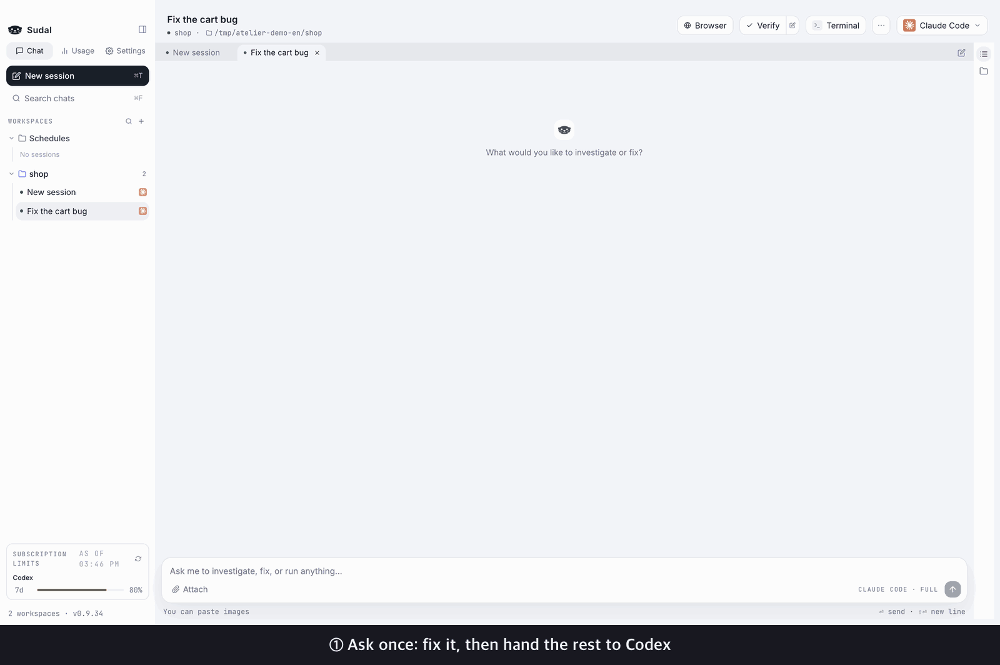
</p>

<p align="center">
  <sub>All I told Claude was: "Fix it, then hand the missing-quantity case and its test to Codex." Claude opened the Codex tab itself, handed off the work, and when Codex finished, collected the result, tested it, and wrapped up. (The waiting parts are sped up.)</sub>
</p>

You don't need an Sudal account. The app finds the `claude` and `codex` CLIs you've already logged in to and uses them, so `CLAUDE.md`, skills, MCP servers, and the rest of your setup apply exactly as they do in the terminal.

## Agents hand off work on their own

Claude Code and Codex inside the app open new tabs with the `sudal` CLI, hand off work, and read the results when it's done. Opening the tab and carrying the result back is the agents' job, not yours.
Install the CLI and skills under Settings → General → **CLI and agent skills** and your agents learn how to use it. It applies to sessions you start after installing. You can run the same commands yourself in a terminal.

```
sudal tab new --provider codex --title "Review" --prompt "Review the code I just changed"
sudal tab send --tab Review --text "Run the tests too" --wait
sudal tab read --tab Review --last 3
```

## Features

<table>
<tr>
<td width="42%" valign="middle">

### Cross-review in one click

Click `···` → "Cross-review" in the header to send the current tab's changes to a new tab on the other agent. The review comes back to the original tab as a card.

</td>
<td width="58%">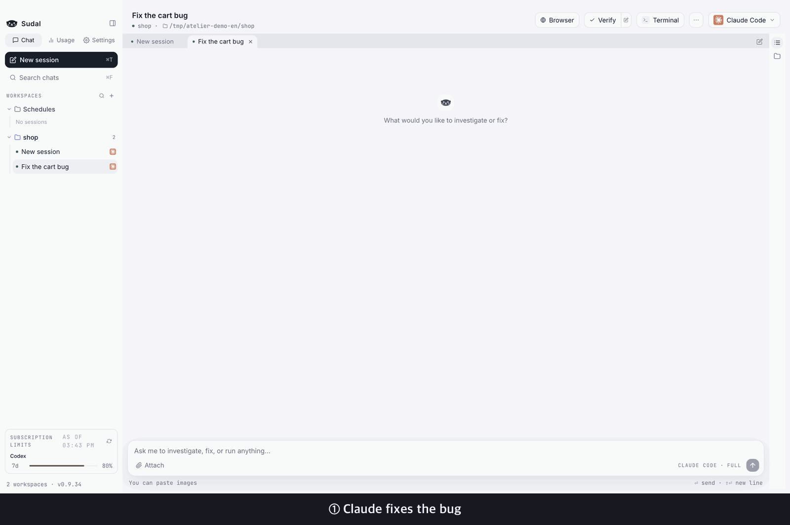</td>
</tr>
<tr>
<td width="42%" valign="middle">

### Split big jobs across workers

A coordinator tab breaks the job down and hands pieces to worker tabs. Workers ask when they're stuck and report when they're done. You can also set the order of tasks and the points where a human decides.

</td>
<td width="58%">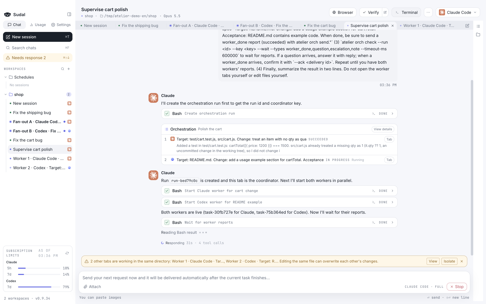</td>
</tr>
<tr>
<td width="42%" valign="middle">

### Send one request to several agents and compare

Fan-out sends the same request to several sessions at once, each in its own isolated git worktree. Compare the resulting diffs side by side and bring only the one you like into your original.

</td>
<td width="58%">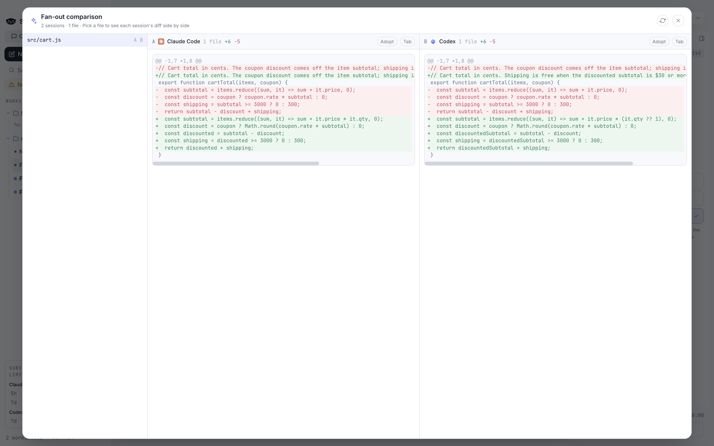</td>
</tr>
<tr>
<td width="42%" valign="middle">

### See what it's about to do first

Before it changes a file or runs a command, it asks with a permission card. Files read, commands run, and code changed pile up as tool cards, so you don't have to chase terminal output.

</td>
<td width="58%">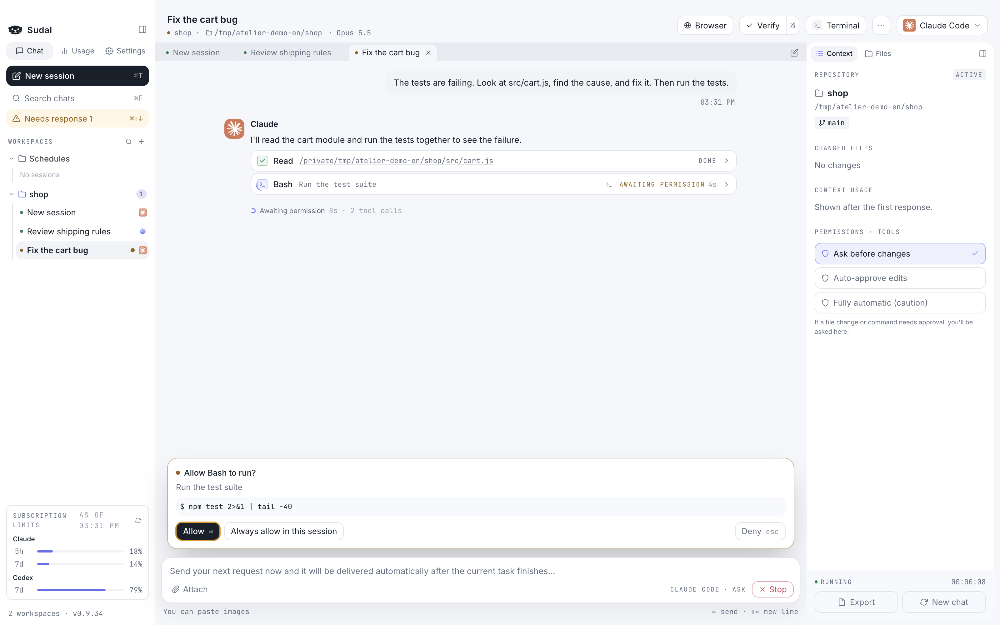</td>
</tr>
<tr>
<td width="42%" valign="middle">

### Check the changes and commit

Run your test and build commands with one button and the results stay in the conversation as cards. Review changed files as diffs, get a draft commit message, and commit right inside the app.

</td>
<td width="58%">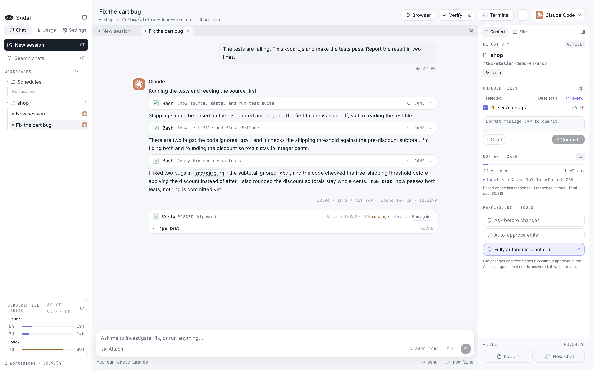</td>
</tr>
<tr>
<td width="42%" valign="middle">

### Open a file and edit it on the spot

Click a file name in an answer and the code editor opens at that line. Lines the agent changed are shown in diff colors. Install a language server (LSP) and you get autocomplete and go-to-definition too.

</td>
<td width="58%">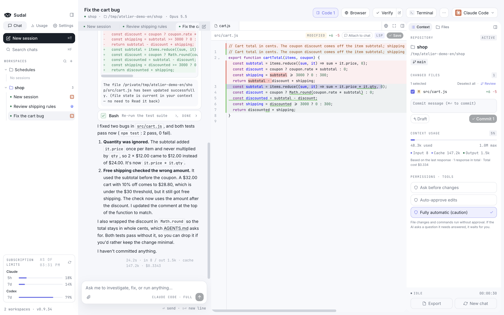</td>
</tr>
<tr>
<td width="42%" valign="middle">

### Read Markdown like a document

Markdown files open as a clean preview, with tables, quotes, code, and checklists rendered. Click "Edit" to change them right away.

</td>
<td width="58%">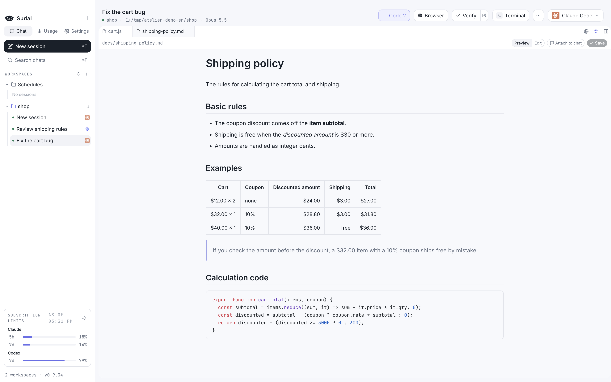</td>
</tr>
<tr>
<td width="42%" valign="middle">

### A terminal right next to it

Open a terminal below or beside the chat, and split it horizontally or vertically. Send a tool card's command straight to the terminal, and click a URL or file path in the output to open it in the browser or editor.

</td>
<td width="58%">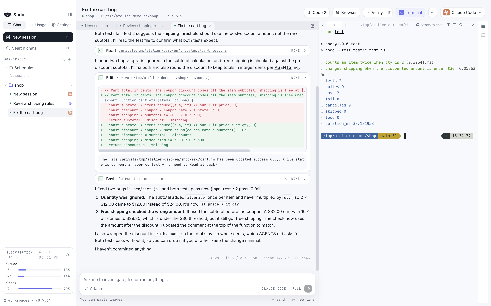</td>
</tr>
<tr>
<td width="42%" valign="middle">

### Continue in terminal

Click `···` → "Continue in terminal" to carry on the same conversation in the Claude or Codex CLI in a terminal. What you exchange in the CLI is drawn into the chat as well, and when you quit the CLI you're back in the chat.

</td>
<td width="58%">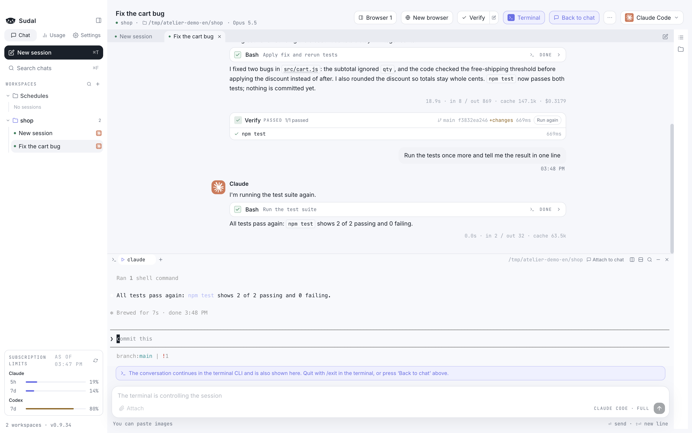</td>
</tr>
<tr>
<td width="42%" valign="middle">

### Check your fixes in the in-app browser

Put the screen you're building next to the chat and switch it to phone or tablet width. Agents can read and click that page with `sudal browser`, so they verify their own fixes.

</td>
<td width="58%">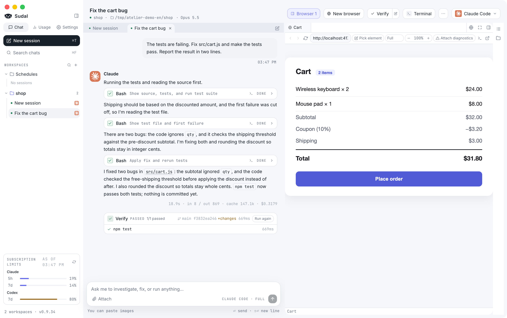</td>
</tr>
<tr>
<td width="42%" valign="middle">

### Sudari keeps you posted

While you work in other apps, Sudari, our otter, sits in the corner of your screen and shows what your agents are doing. Sudari taps a shell while they work, raises a paw when an approval or answer is waiting, and shows off the shell when the work is done. Click Sudari to jump to that tab. Turn it on in Settings → General → Show Sudari.

</td>
<td width="58%">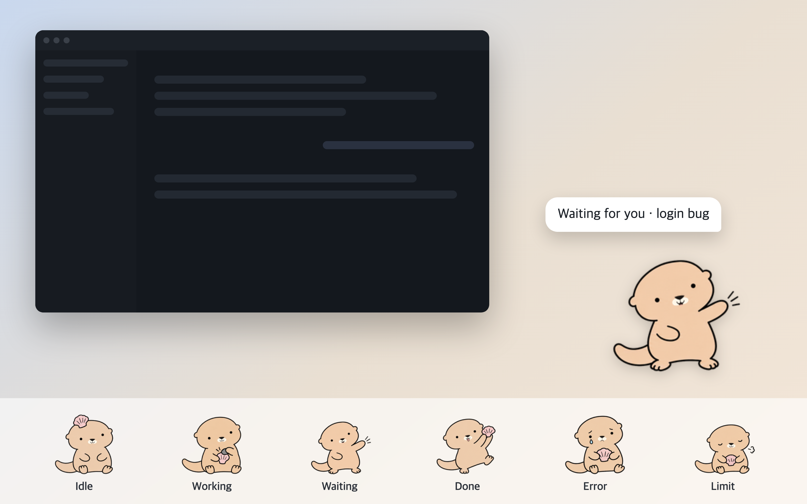</td>
</tr>
</table>

## Supported agents

| Agent | What you need |
|---|---|
| Claude Code | A logged-in `claude` CLI |
| Codex | A logged-in `codex` CLI |

Either one is enough. If you switch agents mid-conversation, Sudal summarizes the conversation so far and passes it along.

## Install

**Requirements**: An Apple Silicon Mac (macOS 13 or later) or 64-bit Windows 10/11, and at least one logged-in `claude` or `codex` CLI.
If you don't have one yet, follow the [Claude Code setup](https://code.claude.com/docs/en/setup) or [Codex CLI setup](https://developers.openai.com/codex/cli) guide, then log in.
On Windows, Claude Code also needs [Git for Windows](https://git-scm.com/downloads/win) (Git Bash).

### macOS

Install with Homebrew.

```
brew tap 97kim/sudal
brew trust --cask 97kim/sudal/sudal
brew install --cask sudal
```

- `brew tap` adds the repository that hosts the Sudal cask to Homebrew.
- `brew trust` is a step Homebrew 7 and later requires. For a cask outside the official list, you have to tell Homebrew once that you trust it. The command above trusts only Sudal, not the whole tap.
- When a new version is out, an update button appears next to the version at the bottom left of the sidebar. Click it to see the progress, then restart when it finishes. You can also update under **Settings → General → Updates**, or in a terminal with `brew update && brew upgrade --cask sudal`. Running `brew upgrade` alone doesn't refresh the tap, so it won't find the new version.

**First launch**: The app isn't signed or notarized, so macOS blocks it once. Try opening the app, and when the block notice appears, go to **System Settings → Privacy & Security** and click "Open Anyway". Once you allow it, the permission carries over to later updates.

<details>
<summary>If "Open Anyway" doesn't appear</summary>

Remove the quarantine attribute in a terminal and the app opens right away.

```
xattr -d com.apple.quarantine /Applications/Sudal.app
```

</details>

To install without Homebrew, download the DMG from [Releases](https://github.com/97kim/sudal/releases) and move `Sudal.app` to your Applications folder.

### Windows

Download `sudal-<version>-x64.exe` from [Releases](https://github.com/97kim/sudal/releases) and run it. It installs for your user account without administrator rights, and Sudal opens when it's done.

**First launch**: The installer isn't code-signed, so Windows SmartScreen shows "Windows protected your PC". Click **More info**, then **Run anyway**.

Updates happen inside the app. When a new version is out, click the update button at the bottom left of the sidebar (or under **Settings → General → Updates**); it downloads the new version, and restarting installs it.

## Start your first task

1. Click **Add workspace** in the sidebar and create a workspace named after your work.
2. Click **Choose working directory…** at the top of the screen and pick the repository folder you'll work in.
3. Pick **Claude Code** or **Codex** at the top right.
4. Type a request in the input box and send it. For example: "The tests are failing. Find the cause and fix it."

Permissions start at "Ask before changes", so before it changes a file or runs a command, it shows you what it's about to do and asks.

## And more

- **Split view**: View two tabs side by side, and switch between them with ⌘⌥←/→.
- **Isolated sessions**: Work in a separate git worktree, so files don't get mixed up even when you run several sessions in the same repository. Branch a finished conversation into a new tab at any point to try a different direction.
- **Prompt queue**: Write your next request while a task is running, and it's sent when the task finishes. With Codex, you can also slip one into the task in progress.
- **Schedules**: Open a new session and send a request at a time you set: hourly, daily, weekdays, weekly, or a cron expression. It runs while the app is open.
- **Slash commands and snippets**: Type `/` to see Claude's commands and skills, and save requests you use often as snippets.
- **Notifications**: Sessions waiting for permission or finished show up in the sidebar, the Dock badge (the taskbar on Windows), and system notifications, and ⌘⇧↓ jumps straight to them.
- **Chat search and export**: ⌘F searches even closed sessions, and you can export a conversation as Markdown.
- **Worktree cleanup**: In settings, see leftover worktrees with their size and number of uncommitted changes, and delete them.
- **Usage**: See usage by model and workspace, estimated cost at API prices, and your Claude and Codex subscription limits.
- **Context and limits**: Warns you before the context window fills up, and when you hit a Claude usage limit, retries at the time it resets.
- Dark mode, image paste, and an indicator for background tasks that keep running after a turn ends.
- **Language**: Use the screens, menus, and notifications in Korean or English. Choose under Settings → General → Language; the default follows your system language.

Shortcuts are written for Mac; on Windows, press Ctrl for ⌘. The full list and what differs on Windows are in the [feature guide](docs/GUIDE.md#keyboard-shortcuts).

## FAQ

### Do I need an account or API key?

You don't need a separate Sudal account. It uses the `claude` and `codex` CLIs you've already logged in to, and billing is just each service's subscription or API pricing.
Sudal runs the CLIs you installed and logged in to yourself. It doesn't collect, store, or relay your credentials, and each service's terms, pricing, and limits apply.

### Where does my code go?

Sudal itself sends nothing anywhere. Communication with the models is handled by the Claude Code and Codex CLIs, as usual.

### Where is my data stored?

Workspaces and chat history are in `~/Library/Application Support/Sudal/` (`%APPDATA%\Sudal\` on Windows), and worktrees for isolated sessions are in `~/sudal/worktrees/`. Open or change them under **Settings → General → Storage location**.

### Does it work on Intel Macs?

For now, only Apple Silicon is supported on Mac. On Windows, only x64 is supported.

## License

[MIT](LICENSE). Keep the copyright notice and license text, and you're free to use, modify, and redistribute it.
The Sudari character is not covered by the MIT License.
Dependencies bundled with the app follow their own licenses. In particular, the Claude Agent SDK is subject to [Anthropic's Commercial Terms](https://www.anthropic.com/legal/commercial-terms).

## Learn more

- [Feature guide](docs/GUIDE.md): The details of how each feature works, plus shortcuts
- [Development docs](docs/DEVELOPMENT.md): Build, release, verification, and structure
